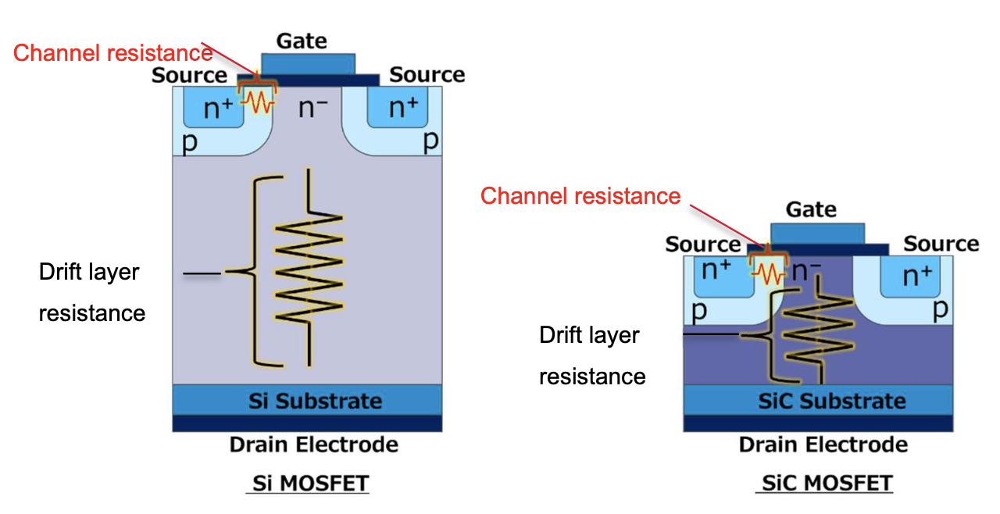

# Karbid křemíku - Nová generace polovodičů
## Karbid křemíku jako materiál
Karbid křemíku (SiC) je krystalický polovodič s širokým zakázaným pásem, který se pohybuje v hodnotách od 2,3-3,3 eV. Disponuje nižším elektrickým odporem, vyšší teplotní odolností, vyšším kritickým polem a spínací rychlostí při porovnání s křemíkem. SiC patří do kategorie polovodičů se širokým zakázaným pásem (WBG - Wide Band Gap), které představují významný posun oproti tradičním křemíkovým technologiím.  

Obrázek 1: Srovnání základních vlastností polovodičů se širokým zakázaným pásem s křemíkem. (Zdroj: [ResearchGate](http://dx.doi.org/10.1109/ACCESS.2022.3174777))

 

### Krystalová struktura
SiC se skládá z 50% Si + 50% C, přičemž uhlík se zde nachází ve sp3 hybridizaci, což ho činí čtyřvazným. Jedná se o polymorfní materiál s více než 250 polytypy identifikovanými do roku 2006, což v praxi znamená, že tvoří vícero krystalických rodin s odlišnými vlastnostmi. V praxi se nejčastěji setkáme s polytypy 3C-SiC, 4H-SiC a 6H-SiC.  

Každý polytyp je složen z množství “dvouvrstev” Si+C, kde jejich orientace určuje konkrétní polytyp. Tyto vrstvy jsou navzájem držené majoritně kovalentími vazbami. Při výrobě desek pro čipy je jedna strana ukončena uhlíkovými atomy a druhá křemíkovými.  

Polytypy se označují podle Ramsdellovy notace, kde číslo označuje počet vrstev v základní buňce a písmeno označuje typ mřížky (H - hexagonální, C - kubická, R - rhomboedrická).  

Obrázek 2: Struktura základních polytypů SiC s vyznačeným opakováním atomových rovin. (Zdroj: [TU Wien](https://www.iue.tuwien.ac.at/phd/rescher/Introduction.html))

| Vlastnosti | Si | 4H-SiC | 6H - SiC | 3C - SiC |
|------------|----|--------|----------|----------|
|Zakázaný pás (eV)|1,12|3,28|3,08|2,35|
|Tepelná vodivost (W/cm·K)|1,5|4,9|4,9|4,9|
|Teplota tání (°C)|1420|~2830*|~2830*|~2830*|
|Průrazné pole (MV/cm) (pro ND = 5x1015 cm-3)|0.3|3.1|3.3|3.8|

*SiC nemá přesně definovaný bod tání, neboť neexistuje stechiometrická SiC tavenina (max. rozpustnost 19% C v Si při 2830 °C), ale sublimuje při teplotě přibližně 2700°C.

### Optoelektrické vlastnosti SiC
Karbid křemíku je, stejně jako křemík, nepřímým polovodičem, což je patrné z jeho pásové struktury. Každý polytyp má odlišné vlastnosti, včetně efektivní hmotnosti elektronů a šířky zakázaného pásu. Tyto vlastnosti se mění s mírou “hexagonality” mřížky, tedy poměrem hexagonálních a kubických poloh v krystalu.  

Pásovou strukturu lze dále modifikovat pomocí teploty nebo dopováním. Podle [výzkumů](https://doi.org/10.1103/PhysRevB.54.10257) z roku 1996 byla provedena detailní analýza pásových struktur různých polytypů SiC kolem fundamentálního zakázaného pásu. Šířka zakázaného pásu se s rostoucí teplotou snižuje, což bylo popsáno několika teoretickými modely, včetně Varshniho vztahu a modelu Bose-Einstein.  

Obrázek 3: Absorbční hrany různých polytypů SiC. (Zdroj: [ResearchGate](http://dx.doi.org/10.1088/0022-3727/44/36/365402))

Nedávný [výzkum](https://doi.org/10.1038/s41467-022-34943-w) také ukázal, že 3C-SiC vykazuje mimořádně vysokou tepelnou vodivost přesahující 5 W/cm·K při pokojové teplotě, což je druhá nejvyšší hodnota mezi velkými krystaly (překonává ji pouze diamant).

### Užití v polovodičovém průmyslu

Díky svým vynikajícím vlastnostem se karbid křemíku používá nejen jako tvrdé abrazivo nebo výplň vysokoteplotních pecí, ale má zásadní význam v elektronice. Konkrétně ve výkonové elektronice, kde se nepracuje s binárnimi vstupy/výstupy, ale s výkony. SiC umožňuje efektivní přenos a konverzi vysokých výkonů, což z něj činí ideálního kandidáta pro tato využití.  

SiC nachází uplatnění v oblasti výkonové elektroniky, optoelektroniky a kvantových výpočtů. SiC zařízení mohou způsobit revoluci v oblasti výkonové elektroniky díky rychlému spínání, nízkým ztrátám a vysokému blokovacímu napětí.

Obrázek 4: Aplikační oblasti SiC v porovnání s křemíkovými technologiemi. (Zdroj: [Infineon](https://my.avnet.com/wcm/connect/685d9653-09a6-4014-881e-ff00d3006d98/Infineon-Product_Flyer_CoolMOS7_CoolSiC_CoolGaN-PB-v06_00-EN.pdf?MOD=AJPERES&CVID=mt01-dg))

### Srovnání Si a SiC MOSFETu
Podíl SiC součástek na trhu bude postupně narůstat, ačkoliv se neočekává, že by v blízké době zcela nahradily křemíkové. Hlavními limitujícími faktory jsou složitější a nákladnější výroba a opracování karbidu křemíku. Na trhu se také začínají prosazovat GaN součástky.   

Vlastnosti SiC umožňují miniaturizaci křemíkových zařízení, což je patrné na příkladu MOSFETu. Širší zakázaný pás dovoluje vyrobit součástku s tenčí a více dopovanou driftovou vrstvou, která slouží k odstínění elektrického pole v zavřeném směru polem řízeného tranzistoru:
- Si: driftová vrstva ~100 μm, koncentrace dopantů 1x1015 cm-3 
- SiC: driftová vrstva ~10 μm, koncentrace dopantů 1x1016 cm-3 => přibližné 100x zvýšení odporu  

Pro [SiC MOSFET](https://www.powerwaywafer.com/sic-mosfet-structure.html) je typická struktura s N-dopovanou driftovou vrstvou o tloušťce 10 μm a koncentrací příměsí 6×1015 cm-3. 

Obrázek 5: Struktura a parametry Si a SiC MOSFETu. (Zdroj: [ROHM Semiconductor](https://fscdn.rohm.com/en/products/databook/applinote/discrete/sic/mosfet/4g-sic-mosfet-characteristics-and-circuit-design-considerations_an-e.pdf))

## Proč větší zakázaný pás?

Výhody širolopásmových polovodičů (WBG), které definujeme při zakázaném pásu >2 eV, zahrnují:
 - **Vyšší účinnost** - možnost použití čipů při vyšších napětích, frekvencích a teplotách -> nižší ztráty
 - **Rychlejší spínací rychlost** - umožňuje snížení velikosti a hmotnosti pasivních komponent pasivních komponent
 - **Vyšší tepelná vodivost** - zvyšuje spolehlivost zařízení; SiC má tepelnou vodivost až 4,9 W/cm·K oproti 1,5 W/cm·K u křemíku
 - **Vyšší hustota výkonu** - umožňuje zmenšení zařízení a zvýšení jejich efektivity
 - **Větší spolehlivost zařízení** - WBG materiály disponují robustnější povahou, což zvyšuje jejich životnost a vede k úspoře nákladů
 
 Příklady těchto materiálů zahrnují SiC, GaN, Ga2O3, ZnO a diamant. Zvláštní zájem budí kubický SiC (3C-SiC), který jako jediný polytyp lze epitaxně pěstovat na křemíku, což přináší výhodu škálovatelnosti vzhledem k omezeným průměrům komerčně dostupných hexagonálních SiC desek.

 ## Zdroje a další počtení
 - ČTVRTLÍK, Radim. Karbid křemíku - Technologie, která mění svět, [přednáška]. Science and Technology Club, 2025 cit. 15. 5. 2025. Dostupné z: https://youtu.be/MY1I8MdcIzM
- NSM Archive - Silicon Carbide (SiC) - Band structure online. cit. 15.5.2025. Dostupné z: https://www.ioffe.ru/SVA/NSM/Semicond/SiC/bandstr.html
- BURIN, Jürgen et al. TCAD Parameters for 4H-SiC: A Review online. CERN Indico, 2024 cit. 15.5.2025. Dostupné z: https://indico.cern.ch/event/1476607/contributions/6218703/attachments/2964604/5215484/Burin_4HSiC_chapter_5.pdf
- What is a wide-band-gap semiconductor? online. Toshiba, 2024 cit. 15.5.2025. Dostupné z: https://toshiba.semicon-storage.com/eu/semiconductor/knowledge/faq/diode_sic-sbd/sic-sbd001.html
- High thermal conductivity in wafer-scale cubic silicon carbide crystals online. Nature Communications, 2022 cit. 15.5.2025. Dostupné z: https://www.nature.com/articles/s41467-022-34943-w
 
