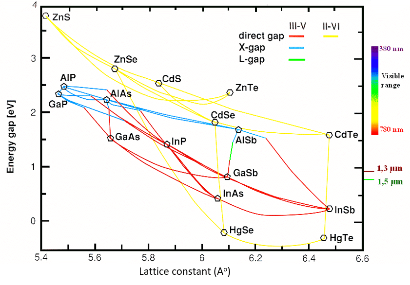

# Cesta k modré LED?
## Co vůbec je LED?
LED (Light-emitting diode) je polovodičové zařízení, které emituje elektromagnetické záření, jehož vlnová délka je lazena pomocí materiálu, ze kterého je dioda vyrobena, nikoli plastovým obalem který ji obklopuje. Jedná se o zařízení, které prakticky ve [všech](https://www.energy.gov/energysaver/led-lighting) ohledech předčí klasické žárovky, prozatím kromě jejich ceny. LED technologie nám umožňuje svícení s delší delší životností, vyšší kvalitou světla, bezpečností a hlavně efektivitou výroby záření.  

Klasické žárovky svítí díky žhavení jejich vlákna (často wolframového) na vysoké teploty, což znamená vysoké tepelné ztráty a minimální výrobu světla. Na teplo se přemění asi 94–98 % elektrické energie a pouze 2–6 % je vyzářeno ve formě světla. LEDky vyrábějí primárně světlo, tedy 50–70 % energie je převedeno do světla.

Obrázek 1: Srovnání LED s ostatními zdroji světla. (Zdroj: [Viribright](https://viribright.com/blogs/insights/comparing-led-vs-cfl-vs-incandescent-light-bulbs))

### Dioda
Dioda je polovodičové zařízení, které se skládá ze dvou částí, konkrétně ze dvou různě dopovaných polovodičů. Většina polovodičů je na bázi křemíku, který se nachází ve 4. skupině periodické tabulky, tedy 4 jeho valenční elektrony se podílejí na tvorbě kovalentních vazeb v krystalu. Tudíž samotný křemík nedisponuje vysokou intrinsickou vodivostí, k čemuž přispívá i šířka zakázaného pásu, která má hodnotu 1,1 eV. Pokud tedy do materiálu dostaneme další **volné** nosiče náboje, můžeme jeho vlastnosti změnit. Dle typu dopování rozlišujeme 2 varianty:
* **N - typ:**
    * Do materiálu jsou vpraveny prvky z 5. skupiny periodické tabulky, což zvýší koncentraci majoritních nosičů náboje, konkrétně elektronů. V pásové struktuře se objeví nová (donorová) hladina, která přispívá k vodivosti materiálu. Je důležité podotknout, že krystal jako celek zůstává elektricky neutrální, neboť obsahuje stejný počet elektronů a protonů (platí pro oba typy dopování).

* **P - typ:**
    * Do materiálu jsou vpraveny prvky ze 3. skupiny periodické tabulky, které mají o 1 valenční elektron méně než křemík, tedy v materiálu se objeví “díry” a tedy i akceptorová hladina v pásové struktuře. Dírám je často přisuzován kladný náboj, neboť působí jako protipól elektronům. Zavádí se tedy “děrová” vodivost jako majoritní. Díry se v polovodiči posouvají pohybem elektronů, kterých se tu ale vyskytuje řádově méně.

Při spojení polovodičů typu N a P dochází ke vzniku P-N přechodu a tedy i obyčejné diody. Dojde k ohybu pásů materiálu, což má za následek difuzi volných nosičů náboje v místě kontaktu. Elektrony z části N začnou zaplňovat díry v části P (tomuto procesu říkáme rekombinace), díky čemuž se obě části nabijí a vznikne tzv. ochuzená zóna a elektrické pole, které zabrání další difuzi volných nosičů náboje.  

V tomto stavu funguje dioda jako usměrňovač, tedy při přiložení externího napětí na diodu v závěrném směru (anoda zdroje na N část diody), dojde k rozšíření ochuzené zóny a diodou neprochází žádný proud. V opačném případě dojde ke zúžení ochuzené zóny a při překonání vnitřního pole polem zdroje dojde k otevření diody a může jí procházet elektrický proud.

Obrázek 2: Pásová struktura LED při emisi světla a zapojení v propustném směru. (Zdroj: [Wikimedia](https://commons.wikimedia.org/wiki/File:PnJunction-LED-E.PNG))

#### LED
LED je speciální verze klasické diody, kdy je polovodič volen tak, aby jeho zakázaný pás odpovídal vlnové délce světla, kterou má dioda emitovat. Elektrony při přechodu z vodivostního pásu do valenčního ztrácí energii, kterou mohou vyslat jako kvantum energie – foton. Jak bylo zmíněno výše, zakázaný pás křemíku se pohybuje na hodnotě 1,1 eV, což odpovídá infračervené části elektromagnetického spektra. Pro červenou, zelenou a modrou diodu je potřeba zvolit jiný materiál.

Obrázek 3: Spektrum viditelného světla. (Zdroj: [J Tech Photonics](https://jtechphotonics.com/?p=36671))

## Materiály pro modrou LED
Křemík se zakázaným pásem na hodnotě 1,1 eV nelze použít jako LED ve viditelném spektru, protože tato energie odpovídá infračervenému záření. Tento typ diod je používán například v dálkových ovladačích.  

Pro vytvoření diody s barvou pravé modré bylo nutné najít materiál se zakázaným pásem na hodnotě ~2,7 eV. Z historického hlediska byl vývoj tlačen do dvou hlavních kandidátů, které tyto parametry splňovaly: ZnSe a GaN. Jako vítězný se nakonec ukázal GaN, který ale představoval spoustu historických výzev při technologii výroby.  

Pro růst tohoto krystalu je používána metoda metal-organické chemické depozice z plynné fáze (MOCVD), která umožňuje růst krystalů na vhodném substrátu z plynných prekurzorů. Největším úskalím je tzv. lattice mismatch neboli nesoulad mřížkových parametrů substrátu a rostoucího krystalu. Je důležité tyto hodnoty držet na podobných číslech, protože jinak při růstu krystalů vzniká velké množství defektů, které snižují kvalitu a tedy i účinnost finálního čipu. Pro růst GaN se užívá safír, s kterým má však neshodu mřížek 16 %, takže na růst kvalitního krystalu je potřeba více kroků a použití mezivrstev.

Obrázek 4: Graf závislosti velikosti zakázaného pásu na mřížkovém parametru. (Zdroj: [ResearchGate](http://dx.doi.org/10.13140/RG.2.2.10928.28169))

Pro výrobu delé diody je potřeba narůst několik vrstev a také dopování do N a P. Pro komerční využití je nutné, aby diody disponovaly výkonem >1 mW, což právě dioda na bázi GaN splňuje.

Obrázek 5: Struktura vrstev modré LED. (Zdroj: [Comsol](https://www.comsol.com/blogs/investigating-led-efficiency-via-multiphysics-simulation))

## Kvantová jáma pro zvýšení účinnosti LED
Pro zvýšení účinnosti LED se využívá efektu tzv. kvantové jámy (quantum well). Jde o extrémně tenkou vrstvu materiálu s menším zakázaným pásem (např. InGaN), která je vložena mezi vrstvy s větším zakázaným pásem (GaN). Tato struktura omezuje pohyb elektronů a děr na velmi malý prostor, čímž výrazně zvyšuje pravděpodobnost jejich rekombinace a tedy i vyzáření světla.
Kvantové jámy umožnily zvýšit účinnost a jas modrých LED na úroveň potřebnou pro praktické využití.  

		„Aby bylo možné zvýšit účinnost LED, zavádí se do aktivní oblasti velmi tenká vrstva – kvantová jáma. Ta omezuje pohyb nosičů náboje, čímž zvyšuje pravděpodobnost rekombinace a tím i množství vyzářených fotonů.“
(Zdroj: Veritasium, čas 14:40–15:20)

Obrázek 6: Zvýšení efektivity diody pomocí kvantové jámy. (Zdroj: [GoPhotonics](https://www.gophotonics.com/community/what-are-quantum-well-lasers))

## Historie vývoje modré LED
První LED diody vyzařovaly červené (od 60. let) a později zelené světlo. Vývoj modré LED byl dlouho považován za téměř nemožný kvůli chybějícím vhodným materiálům a technologickým překážkám.  

Průlom přišel až v 80. a 90. letech v Japonsku, kde Isamu Akasaki a Hiroshi Amano vyvinuli metody růstu kvalitního GaN a jeho dopování na P-typ. Klíčovým krokem bylo zavedení kvantových jam z InGaN.  

V roce 1993 představil Shuji Nakamura první vysoce účinnou modrou LED na bázi GaN, která byla několikanásobně jasnější než předchozí pokusy. Kombinace modré LED a fosforu umožnila vznik bílého světla a tím i LED žárovek a displejů.
Za tento objev byla v roce 2014 udělena Nobelova cena za fyziku. Modrá LED znamenala revoluci v oblasti osvětlení a elektroniky.

 ## Zdroje a další počtení
 - VERITASIUM. Why It Was Almost Impossible to Make the Blue LED , [přednáška]. Veritasium, 2025 cit. 18. 5. 2025. Dostupné z: https://youtu.be/AF8d72mA41M?si=6mZS_76LEyuDNS76
- [Energy.gov: LED Lighting](https://www.energy.gov/energysaver/led-lighting)
- [Viribright: Comparing LED vs CFL vs Incandescent Light Bulbs](https://viribright.com/blogs/insights/comparing-led-vs-cfl-vs-incandescent-light-bulbs)
- [J Tech Photonics: What is the Wavelength of Visible Light?](https://jtechphotonics.com/?p=36671)
- [Comsol: Investigating LED Efficiency via Multiphysics Simulation](https://www.comsol.com/blogs/investigating-led-efficiency-via-multiphysics-simulation)
- [Nobel Prize: Blue LEDs – Filling the world with new light](https://www.nobelprize.org/prizes/physics/2014/press-release/)
- [ResearchGate: Bandgap vs Lattice Constant](http://dx.doi.org/10.13140/RG.2.2.10928.28169)
